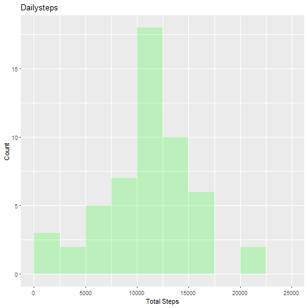
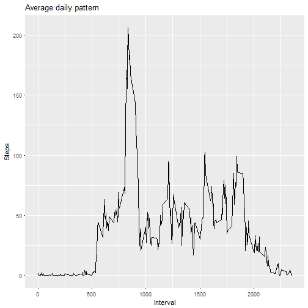
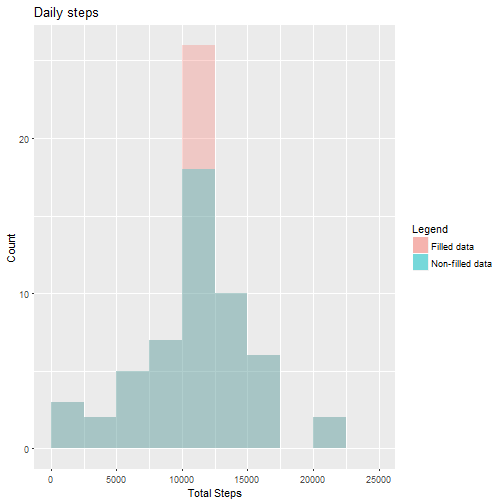
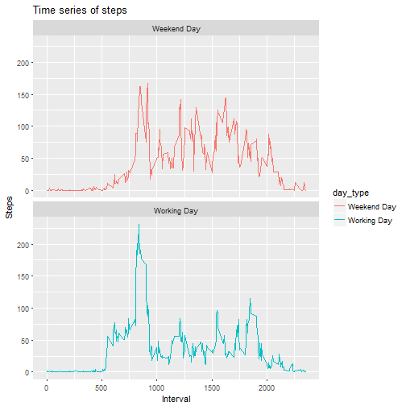

## Introduction
This is the second week assignment for the course `Reproducible Research` of Coursera Data Science program.  
Data analysed regards the number of step collected using a Fitbit device.  
The data can be download from [Dataset](https://d396qusza40orc.cloudfront.net/repdata%2Fdata%2Factivity.zip) [52K]  
  
Variables considered are:  

* **steps**: Number of steps in a 5-minute interval (`NA` indicates missing values)

* **date**: The date when the measurement is taken

* **interval**: Identifier for the 5-minute interval 


## Assignment  
### Download Libraries
Load the required packages.

```r
library(ggplot2)
library(plyr)
library(dplyr)
```
   
### Download and load of data
Download the zip containing the data and load the data.

```r
if(!file.exists("Dataset.zip")){
        fileUrl <- "https://d396qusza40orc.cloudfront.net/repdata%2Fdata%2Factivity.zip"
        download.file(fileUrl,destfile="./Dataset.zip")
        unzip("Dataset.zip")
}

data <- read.csv("activity.csv", stringsAsFactors = FALSE)
```
   
### Data analysis
#### Daily Number of Steps
Computation of the total number of steps per day. We ignore for now `NA` values.

```r
data_steps <- data[!is.na(data$steps),]
daily_steps <- tapply(data_steps$steps, data_steps$date, FUN = sum)
daily_steps <- data.frame(count = daily_steps, date = names(daily_steps),row.names = NULL)
head(daily_steps)
```

```
##   count       date
## 1   126 2012-10-02
## 2 11352 2012-10-03
## 3 12116 2012-10-04
## 4 13294 2012-10-05
## 5 15420 2012-10-06
## 6 11015 2012-10-07
```
   
Plot of the histogram of the frequency of the total number of steps per day.

```r
ggplot(data=daily_steps, aes(daily_steps$count)) + 
        geom_histogram(breaks=seq(0, 25000, by = 25000/10), fill="green", alpha = .2) + 
        labs(title="Dailysteps") + labs(x="Total Steps", y="Count")
```


  
Computation of the mean and the average of the daily steps.

```r
median(daily_steps$count)
```

```
## [1] 10765
```

```r
mean(daily_steps$count)
```

```
## [1] 10766.19
```
  
#### Daily Pattern
Computation of the mean of each interval of the day.

```r
xx <- tapply(data_steps$steps, data_steps$interval, FUN = mean)
xx <- data.frame(steps = xx, interval = as.numeric(names(xx)),row.names = NULL)
head(xx)
```

```
##       steps interval
## 1 1.7169811        0
## 2 0.3396226        5
## 3 0.1320755       10
## 4 0.1509434       15
## 5 0.0754717       20
## 6 2.0943396       25
```
   
Time series of the daily pattern.

```r
ggplot(data = xx,aes(interval, steps)) + geom_line() + 
        labs(title="Average daily pattern") + labs(x="Interval", y="Steps")
```


  
#### Fill NA values
The number of NA's is computed:

```r
sum(is.na(data$steps))
```

```
## [1] 2304
```
   
It has been chosen to substitute NA values of the steps value inputting the average value computed for each interval.

```r
data_filled <- data
data_filled[is.na(data$steps),1] <- mapvalues(data[is.na(data$steps),3], xx$interval, xx$steps)
```
   
Computation of total steps per day and plotting of the related histogram.

```r
xxx <- tapply(data_filled$steps, data_filled$date, FUN = sum)
xxx <- data.frame(daily_steps = xxx, date = names(xxx))
ggplot() + 
        geom_histogram(data=xxx, aes(daily_steps, fill = "Filled data"), breaks=seq(0, 25000, by = 25000/10), alpha = 0.3) +
        geom_histogram(data=daily_steps, aes(count, fill = "Non-filled data"), breaks=seq(0, 25000, by = 25000/10), alpha = 0.3) +
        labs(fill="Legend", title = "Daily steps", x="Total Steps", y="Count")
```


   
Computation of the mean and the average of the daily steps.

```r
median(xxx$daily_steps)
```

```
## [1] 10766.19
```

```r
mean(xxx$daily_steps)
```

```
## [1] 10766.19
```
The mean is the same as before. The change of the median value is negligible.   
   
#### Work days and weekend days comparison
Creation of a variable describing the type of weekday.

```r
data_filled$date <- as.Date(data_filled$date,format = "%Y-%m-%d")
data_filled$weekday <- weekdays(data_filled$date)
data_filled$day_type[(data_filled$weekday == "Saturday" | data_filled$weekday == "Sunday")] <- "Weekend Day"
data_filled$day_type[!(data_filled$weekday == "Saturday" | data_filled$weekday == "Sunday")] <- "Working Day"
```
   
Time series of the average daily pattern for weekend days and work days

```r
groups <- group_by(data_filled, interval, day_type)
xxxx <- summarise(groups, mean(steps)); names(xxxx)[3]<- "steps"
ggplot(data = xxxx,aes(interval, steps, color = day_type)) + geom_line() + facet_wrap(~day_type, ncol = 1, nrow=2) + labs(title = "Time series of steps", x="Interval", y="Steps")
```


